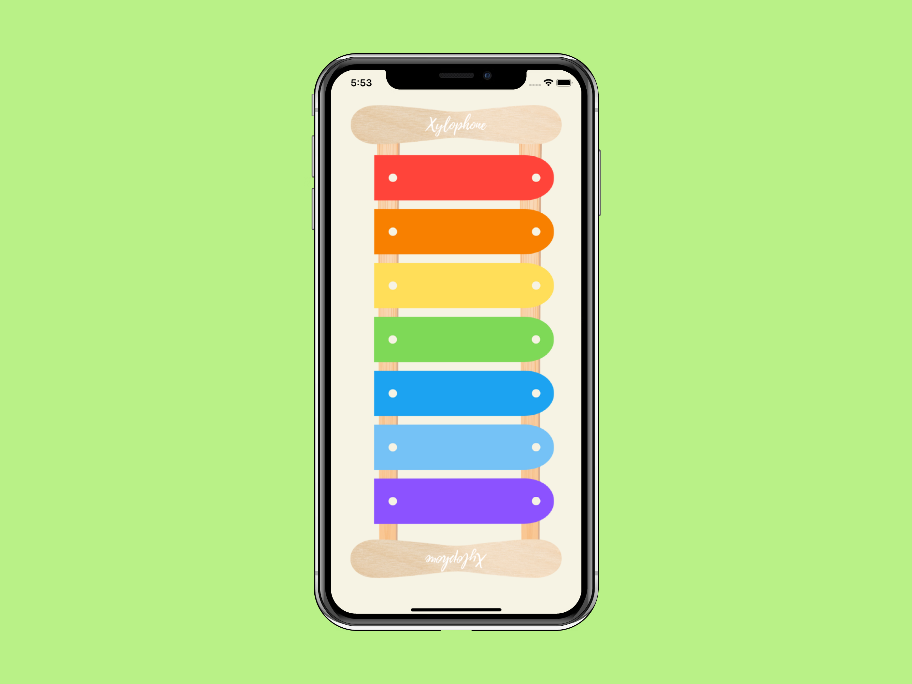

# XylophoneWithSwift

**Description:**

XylophoneWithSwift is a fun music application developed using the Swift programming language and Storyboard. This app offers a virtual xylophone experience, allowing users to explore different sounds by touching various colored keys.

**Features:**

Play various music notes by touching different colored keys.
Each key produces a unique sound, enabling you to create different melodies and songs.
Start playing quickly with a simple and user-friendly interface.
An excellent app for enhancing your musical skills and creating enjoyable melodies.

**Technologies Used:**

The app is developed using the Swift programming language.
Storyboard is used for user interface design.

